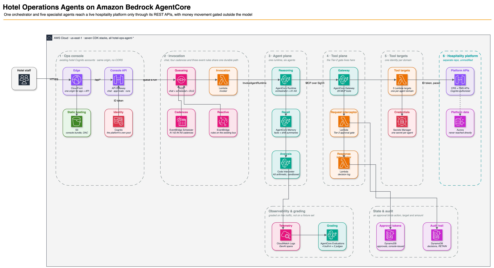

# Hotel Operations Agents

A multi-agent AI operations layer for a hotel chain, built on **Amazon Bedrock AgentCore** with the **Strands Agents SDK**, inferring on **Claude Sonnet 5**.

One orchestrator coordinates five specialist agents that read and write a live hospitality platform **exclusively through its public REST APIs** — no database access, no schema changes, nothing modified in the platform it sits on.

The point of the project is not that agents can call hotel APIs. It is that a reasoning layer makes measurably better operational decisions than the queries it replaces, and that it can be trusted to act unsupervised because the things it must never do are enforced outside the model.

> [!IMPORTANT]
> **This is an extension, not a standalone application.** It requires a deployed
> instance of **[aws-samples/sample-hospitality-systems](https://github.com/aws-samples/sample-hospitality-systems)**
> — the CRS + PMS reference platform the agents operate — in the same AWS account and
> Region, with its seed data loaded. Deploy that first; this project reads its stack
> outputs at synth time and refuses to synthesize without them. See
> [Prerequisite: the hospitality platform](#prerequisite-the-hospitality-platform).
>
> Using a different CRS or PMS? See the **[Pattern Extension Guide](PATTERN_EXTENSION_GUIDE.md)**.

## The delta, on real data

The platform assigns rooms with a single query: highest floor, lowest room number, first match. Given the same 14 arrivals and the same inventory:

| | Agent | The existing `ORDER BY floor DESC, room_number ASC LIMIT 1` |
|---|---|---|
| Room type matches what the guest booked | **7 of 7 placed** | **1 of 14** |
| Accessibility-reserved rooms given to guests with no such need | **0** | **2** |
| Arrivals left unplaced, with a stated reason | 7 — Standard Double Queen was oversold 11 bookings to 4 rooms, and a downgrade is a rate decision, not the agent's | 0 — every guest placed, most of them wrongly |

The agent refusing to place seven guests is the more interesting half. It ranked the four available rooms by loyalty tier, gave them to the three Diamond members and the Gold member one stay from Diamond, flagged ten Deluxe rooms as an upgrade path, and stopped — because silently downgrading a booking is a commercial decision a human owns.

## What it found in the platform

Given read access and a reason to look, the agents surfaced three defects nobody had reported:

- **A live overcharge on a settled folio.** Five room-night charges for a four-night stay — the fifth dated on the departure day. The cause is in the platform's night audit, which posts a room charge for every checked-in guest, including those departing that morning. Folios it has already settled stay wrong even once the code is fixed.
- **`GET /reporting/occupancy` ignores its own `startDate`.** Three different historical windows return byte-identical data. A5 reported it unprompted, and it was right: the parameter is accepted and used by no query in the handler.
- **A dead event rule.** The platform routes `billing.payment_processed` to its loyalty service; nothing publishes that event.

## The agents

| # | Agent | Authority | Job |
|---|---|---|---|
| — | **Orchestrator** | routes only | Picks the specialist, sequences multi-domain work, resolves conflicts. Specialists never call each other. |
| **A1** | Arrivals & Room Assignment | Tier 1 · auto-executes | Pre-assigns rooms on loyalty tier, accessibility need, bed configuration, occupancy fit and floor spread |
| **A2** | Housekeeping Flow | Tier 1 · auto-executes | Sequences and assigns cleaning tasks across the room-status state machine, batching by floor |
| **A3** | Billing & Folio Integrity | Tier 2 · propose-and-confirm | Finds missing, duplicated and mis-posted charges. **Cannot move money without a human's approval.** |
| **A4** | Night Audit Readiness | Tier 3 · advise-only | Pre-audit exception report: unresolved folios, overdue checkouts, rooms stuck mid-state, metric disagreements |
| **A5** | Regional Performance | Tier 3 · advise-only | Cross-property occupancy and revenue analysis, with arithmetic done in a sandboxed Code Interpreter rather than in the model's head |

### The one rule the system enforces mechanically

**An agent may reorganize work freely and must never move money on its own.**

Three tools move money — `post_charge`, `void_folio`, `adjust_loyalty` — and all three are refused by a Gateway request interceptor that runs *before* the tool Lambda, outside the model's reach. A prompt injection can talk a model into attempting a charge; it cannot talk that interceptor into allowing one, because the model has no channel to it.

An approval is bound to **one action, one target, and every argument the proposal captured** — the amount, the points, the folio line's description, the reason — and nothing it did not capture may be added at execution. An approval to post $41.50 to folio A will not release $41.50 on folio B, and will not release $4,150 on folio A. Both gates — the interceptor and the billing Lambda — enforce all three bindings, independently, so neither being misconfigured opens the door.

## Architecture



<sub>Source: [`docs/hotel-operations-agents-architecture.drawio`](docs/hotel-operations-agents-architecture.drawio) — regenerate with `infra/.venv/bin/python scripts/build_architecture_diagram.py`. The PNG has the diagram XML embedded, so opening it in draw.io recovers the editable source.</sub>

### Why the tool layer is Lambda and not an OpenAPI target

The platform authorizes every write on `cognito:groups` and scopes it on `custom:property_id`. **Those claims exist only in a Cognito user ID token** — an OAuth client-credentials token carries scopes but no groups and no custom attributes.

So AgentCore Gateway's OpenAPI targets with 2-legged OAuth cannot call these APIs at all: the platform's own authorizer would reject every request. Each Gateway target is therefore a **Lambda** that signs in as a dedicated Cognito *user* and forwards the `IdToken`.

That constraint turns out to be the best thing about the design. One Cognito user per agent means **per-agent group scoping enforced by the platform's authorizer, not by prompt wording**: the housekeeping agent is in the `Housekeeping` group, so it cannot post a charge even if something convinces it to try.

### Seven stacks, all additive

| Stack | Contents |
|---|---|
| `identity` | One Cognito user per agent + per-property housekeeping users, passwords in Secrets Manager. `Delete` is a deliberate no-op. |
| `tools` | Five arm64 Lambdas and a shared layer — the only path to the platform |
| `agentcore` | Gateway, 29 tools, both interceptors, Memory, Code Interpreter, Runtime, `production` endpoint |
| `orchestration` | Decision-log and approvals tables, queue-backed invoker + DLQ, Scheduler cadences, event rules |
| `api` | The console's backend — chat, approvals, run history — behind a Cognito authorizer |
| `frontend` | S3 + CloudFront + OAC, with the API as a second origin so everything is same-origin |
| `evaluation` | Online evaluation: four built-in trajectory graders plus two custom LLM-as-a-judge rubrics |

## Prerequisite: the hospitality platform

This project is **additive and read-mostly** toward the platform it extends. Deploy that first:

### 👉 [aws-samples/sample-hospitality-systems](https://github.com/aws-samples/sample-hospitality-systems)

A full CRS + PMS reference platform — reservations, check-in/out, housekeeping, folios, loyalty, reporting — with no reasoning layer. This repository adds the reasoning layer.

**Order matters.** Deploy the platform with its own [deployment guide](https://github.com/aws-samples/sample-hospitality-systems/blob/main/DEPLOYMENT.md), including its database migrations and seed scripts, and confirm you can sign in to its PMS console. Only then deploy this project, into the **same account and Region** (`us-east-1` by default). If you chose a stack name other than `anycompany-booking`, pass `-c foundationStackName=<yours>` to every `cdk` command.

The platform's API surface this project depends on — routes, stack outputs, Cognito groups and claims, and event names — matches the public repository as of commit [`7fdc3fe`](https://github.com/aws-samples/sample-hospitality-systems/commit/7fdc3fe) (June 2026). A later platform release that renames any of those is a breaking change for this one.

Five stack outputs are resolved read-only at synth time by `infra/stacks/foundation_config.py`, and a missing one fails the synth rather than producing a stack that deploys cleanly and then 403s at runtime:

| Output | Used for |
|---|---|
| `ApiUrl` | CRS REST API base URL |
| `PmsApiUrl` | PMS REST API base URL |
| `UserPoolId` | The Cognito pool both the agents and the staff authenticate against |
| `AdminAuthClientId` | `ADMIN_USER_PASSWORD_AUTH` client, for agent sign-in |
| `UserPoolClientId` | The SPA client the ops console signs staff in with |

**What this project adds to the platform, and nothing more:** new Cognito *users* (the agent identities) and new EventBridge *rules* on the existing bus. No API, schema, data model, or CloudFormation resource of the platform is touched. A non-interference check runs before and after every deploy and asserts the platform's stack status, last-updated timestamp, and Cognito group count are unchanged.

## Getting started

**→ [Implementation Guide](IMPLEMENTATION_GUIDE.md)** — prerequisites, deploy order, verification at each layer, configuration, troubleshooting, teardown.

**→ [Demo Guide](DEMO_GUIDE.md)** — six walkthroughs, one per agent plus the approval loop, with what to say and where to look.

**→ [Pattern Extension Guide](PATTERN_EXTENSION_GUIDE.md)** — plugging the agents into a different CRS or PMS: the five seams to rewrite, the design rules to keep, and what to do when a platform cannot scope identities the way this one does.

The short version, once the platform is deployed:

```bash
export AWS_PROFILE=<your-profile> AWS_REGION=us-east-1

python3 -m venv infra/.venv && infra/.venv/bin/pip install -r infra/requirements.txt
npm install -g aws-cdk

scripts/build_agents.sh                     # vendors arm64 wheels for the Runtime
npx cdk bootstrap --app "infra/.venv/bin/python infra/app.py"
# one property the schedules and event rules cover (all ship DISABLED)
npx cdk deploy --all -c pilotPropertyIds=<property-uuid> \
  --app "infra/.venv/bin/python infra/app.py"

scripts/register_staff_scope.py seed --apply   # who may use the console, and where
scripts/build_frontend.sh                   # reads Cognito ids from the deployed API
npx cdk deploy hotel-ops-agent-frontend --app "infra/.venv/bin/python infra/app.py"
```

## Verification

Nothing here is asserted from a synthesized template alone. Every layer is checked against deployed resources.

| Layer | What it proves | Result |
|---|---|---|
| 1 · `verify_tools.py` | Each tool Lambda signs in and reaches the platform; per-agent scoping holds | 24/24 |
| 2 · `verify_gateway.py` | Tools discoverable through the real Gateway; a live dispatch end to end; the Tier-2 gate refuses with no model in the path | 10/10 |
| 3 | The deployed Runtime pre-assigns rooms, read back out of the platform | see the delta above |
| 4 · `verify_console.py` | **The approval loop.** A released token opens the gate; the same token is refused for another folio and another amount | 25/25 |
| 5 · `verify_orchestration.py` | Tables, invoker, decision log, and event-rule patterns against real event shapes | 30/30 |
| 6 | Non-interference: the platform's stack is untouched | clean, every deploy |
| 7 · `pytest tests/unit` | Fully offline — no credentials, no request can reach the platform | 237 passing |
| · `verify_evaluation.py` | Graders are actually grading, with reasons attached | 12/13 |

```bash
infra/.venv/bin/python -m pytest tests/unit -q          # offline, no credentials
AWS_PROFILE=... tests/integration/verify_tools.py       # against deployed resources
```

The integration checks are scripts rather than pytest suites, deliberately: a bare `pytest` run can never invoke a deployed Lambda or touch the platform.

## Layout

```
infra/            Python CDK app — seven stacks, all named hotel-ops-agent-*
  stacks/         One module per stack
  lambdas/        Interceptors, the invoker, and the console API
agents/           Strands orchestrator + five sub-agents, deployed to AgentCore Runtime
  prompts/        One system prompt per agent — the reasoning lives here
tools/            Gateway Lambda targets, one per agent domain
  layer/          Shared: Cognito ID-token client and MCP tool dispatch
schemas/          MCP tool schemas, one JSON file per target
frontend/         Ops console — React 18, Vite, Tailwind
tests/unit/       Offline, with the platform replaced by fakes
tests/integration/ Verification scripts, run explicitly against deployed resources
scripts/          Build helpers for the Runtime bundle, the console, and this diagram
docs/             The architecture diagram, draw.io source and exported PNG
```

## Design notes

`hotel-operations-agent.md` is the development specification the implementation follows: the sub-agent interface contract, the identity model, the approval tiers, the orchestration cadences, and the guardrails.

[`PATTERN_EXTENSION_GUIDE.md`](PATTERN_EXTENSION_GUIDE.md) §3 states the platform-independent design rules the source cites by section number: the agent is a staff member, tools are existing endpoints behind one thin wrapper, three tiers of authority, and two kinds of record.

Beyond that, the code carries its own reasoning. Where a decision was surprising, expensive to rediscover, or wrong the first time, the comment says so — including the six undocumented AgentCore Evaluations constraints each learned from a deploy failure, and the several places where a fix shipped, failed against live data, and had to be redone.

## Security

See [CONTRIBUTING](CONTRIBUTING.md#security-issue-notifications) for more information.

> [!WARNING]
> This is sample code, for non-production usage. You should work with your security
> and legal teams to meet your organizational security, regulatory and compliance
> requirements before deployment.

It is not a production service. It deploys agents that can write to a
live hotel platform, and the reference platform itself ships with a demo security
posture in its non-production stages (no MFA, wildcard CORS, WAF rules in count mode). Read
[Production hardening](IMPLEMENTATION_GUIDE.md#8-production-hardening) before pointing
it at anything real.

## Cost

Deploying this creates billable resources — AgentCore Runtime, Gateway, Memory and
Evaluations, Bedrock model inference, Lambda, DynamoDB, SQS, API Gateway and CloudFront.
Each agent run spends 5k–20k model tokens. See [Cost](IMPLEMENTATION_GUIDE.md#10-cost)
and [Teardown](IMPLEMENTATION_GUIDE.md#11-teardown).

## License

This library is licensed under the MIT-0 License. See the [LICENSE](LICENSE) file.
